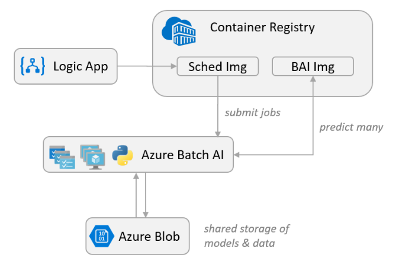

# Scoring Anomaly Detection Models at Scale using Batch AI
In this repository you will find a set of scripts and commands that help you build a scalable solution for scoring many models in parallel using Batch AI.

The solution can be used as a template and can generalize to different problems. The problem addressed here is monitoring the operation of a large number of devices in an IoT setting, where each device sends sensor readings continuously. We assume there are pre-trained [anomaly detection models](http://scikit-learn.org/stable/modules/outlier_detection.html#outlier-detection) (one for each device) that need to be used to predict whether a series of measurements, that are aggregated over a predefined time interval, correspond to an anomaly or not.

## Architecture


## Prerequisites
- Python 3.6
- [Jupyter Notebook](http://jupyter.org/index.html) - *pip install jupyter*
- [azure package 4.0.0](https://pypi.org/project/azure/) - *pip install azure==4.0.0*
- [Azure CLI 2.0](https://docs.microsoft.com/en-us/cli/azure/install-azure-cli?view=azure-cli-latest)
- [Docker](https://www.docker.com/)
- [JQ](https://stedolan.github.io/jq/) - *sudo apt-get install jq*


> *All scripts and commands were tested on an Ubuntu 16.04 LTS system.*

Once all prerequisites are installed, clone or download this repo and start creating the required resources.

## Creating Azure Resources
The following notebook contains all Azure CLI and Docker commands needed to create resources in your Azure subscription, as well as configurations of Batch AI and the Python scoring script.  

[create_resources.ipynb](create_resources.ipynb)

## Starting the Pipeline

## Cleanup
If you wish to delete all created resources, run the following CLI command to delete the resource group and all underlying resources.

```bash
az group delete --name <resource group name>
```

## Links
- [End-to-End Anomaly Detection Jobs using Azure Batch AI](https://github.com/saidbleik/batchai_mm_ad)
- [Batch AI Documentation](https://docs.microsoft.com/en-us/azure/batch-ai/)
- [Logic Apps Documentation](https://docs.microsoft.com/en-us/azure/logic-apps/)

## Contributing

This project welcomes contributions and suggestions.  Most contributions require you to agree to a
Contributor License Agreement (CLA) declaring that you have the right to, and actually do, grant us
the rights to use your contribution. For details, visit https://cla.microsoft.com.

When you submit a pull request, a CLA-bot will automatically determine whether you need to provide
a CLA and decorate the PR appropriately (e.g., label, comment). Simply follow the instructions
provided by the bot. You will only need to do this once across all repos using our CLA.

This project has adopted the [Microsoft Open Source Code of Conduct](https://opensource.microsoft.com/codeofconduct/).
For more information see the [Code of Conduct FAQ](https://opensource.microsoft.com/codeofconduct/faq/) or
contact [opencode@microsoft.com](mailto:opencode@microsoft.com) with any additional questions or comments.
